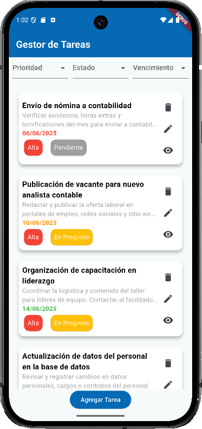
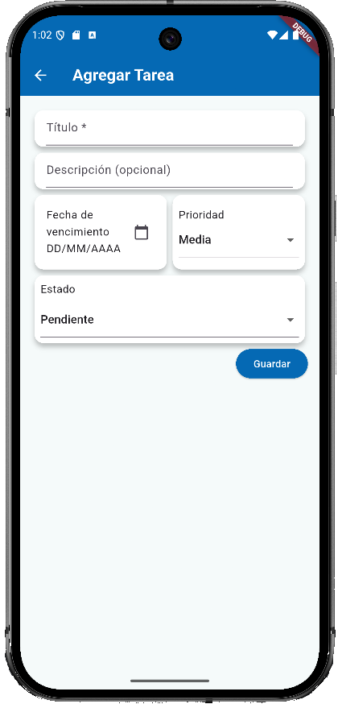

# 📋 Gestor de Tareas - Flutter

Este proyecto es una aplicación móvil desarrollada con **Flutter** que permite a los usuarios crear, leer, actualizar y eliminar tareas. Integra **Firebase Firestore** como base de datos en tiempo real para gestionar la persistencia de los datos.

## 🚀 Descripción del Proyecto

**Gestor de Tareas** tiene como objetivo facilitar la organización personal mediante una interfaz intuitiva para el manejo de tareas diarias. Cada tarea tiene un título, descripción, fecha de vencimiento, prioridad y estado. La aplicación también permite convertir las tareas a formato JSON para interoperabilidad con otros sistemas.

---
## 👁 Vista App

| Pantalla Principal | Pantalla Agregar Tarea |
|--------------------|------------------------|
|  |  |

🔗 [Ver video demostrativo](https://youtube.com/shorts/PhVVbzG62Oc?feature=share)

### 🎯 Características

- Visualización de detalles de una tarea.
- Edición y eliminación de tareas.
- Confirmación antes de eliminar una tarea.
- Codificación JSON para exportar tareas.
- Indicadores visuales por prioridad y estado.
- Integración con Firebase Firestore.

---

## 🛠️ Framework y Lenguaje

- **Framework:** Flutter
- **Lenguaje:** Dart
- **Base de datos:** Firebase Firestore

---

## 🧰 Paquetes externos utilizados

- 🔥 **Firebase Core**: Inicialización y configuración base de Firebase en Flutter.
- 💾 **Cloud Firestore**: Base de datos en tiempo real para almacenar mensajes.
- 🎨 **flutter/material.dart**: Componentes visuales y diseño.
- 📅 **intl**: Para formatear fechas y otros valores internacionales.

---

## 📦 Estructura Básica del Proyecto

```
lib/
│
├── constants.dart              # Colores, estilos y textos constantes
├── main.dart                   # Punto de entrada de la aplicación
│
├── screens/
│ ├── add_task_screen.dart      # Pantalla para crear una nueva tarea
│ ├── task_detail_screen.dart   # Vista de detalle de una tarea
│ ├── task_screen.dart          # Pantalla principal que lista todas las tareas
│ └── update_task_screen.dart   # Pantalla para actualizar una tarea
│
└── widgets/
  └── task_card.dart            # Widget visual para mostrar una tarea en forma de tarjeta
```
---

## ⚙️ Instrucciones para Ejecutar el Proyecto

Sigue estos pasos para clonar y ejecutar la aplicación en tu máquina local:

- **Clona el repositorio**: Abre una terminal y ejecuta
   ```
   git clone https://github.com/MariaJoseMendieta/gestor_de_tareas_flutter.git
   cd gestor_de_tareas_flutter
   ```
  
- **Asegúrate de tener Flutter instalado**:
  Si no tienes Flutter instalado, sigue la guía oficial:
  👉 https://docs.flutter.dev/get-started/install

  Puedes verificar si Flutter está correctamente instalado ejecutando:
    ```
    flutter doctor
    ```

- **Instala las dependencias del proyecto**: Una vez estés en la carpeta del proyecto, ejecuta:
    ```
    flutter pub get
    ```
  
- **Conecta un emulador o dispositivo físico y ejecuta la aplicación**:
    ```
    flutter run
    ```

---

## 👤 Autor

Desarrollado por **María José Mendieta Ortiz**   
🌐 https://github.com/MariaJoseMendieta
